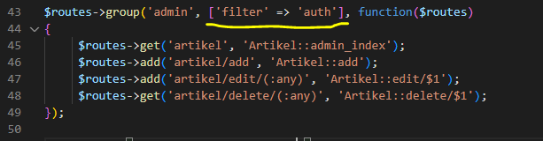

# Web13Lab13

**Nama    : Aning Kinanti** <br>
**NIM     : 312010364** <br>
**Kelas   : TI.20.A2** <br>
**Matkul  : Pemrograman Web** <br>

# Framework (Codeigneter 4) Lanjutan Modul LOGIN
1. Buka kembali folder `lab11ci` pada htdocs
2. Jalankan xampp dan cli seperti pada penjelasan lab11web

## A. Membuat Modul Login dengan CodeIgneter4
### 1. Membuat Database 
Buka database yang telah dibuat sebelumnya dengan nama `lab_ci4` pada phpmyadmin, lalu buat table dengan nama `user` seperti dibawah ini : <br>
 <br>
<br>

### 2. Membuat Model User
Kemudian buat Model untuk memproses data Artikel. Buat file baru pada direktori `app/Models` dengan nama `UserModel.php`, lalu isi dengan sintaks seperti dibawah ini : <br>
```
<?php

namespace App\Models;

use CodeIgniter\Model;

class UserModel extends Model
{
    protected $table = 'user';
    protected $primaryKey = 'id';
    protected $useAutoIncrement = true;
    protected $allowedFields = ['username', 'useremail', 'userpassword'];
}
```
<br>

### 3. Membuat Controller User
Kemudian buat Controller baru pada direktori `app/Controllers` dengan nama `User.php`, lalu isi dengan sintaks seperti dibawah ini : <br>
```
<?php

namespace App\Controllers;

use App\Models\UserModel;

class User extends BaseController
{
    public function index()
    {
        $title = 'Daftar User';
        $model = new UserModel();
        $users = $model->findAll();
        return view('user/index', compact('users', 'title'));
    }

    public function login()
    {
        helper(['form']);
        $email= $this->request->getPost('email');
        $password = $this->request->getPost('password');
        if(!$email)
        {
            return view('user/login');
        }

        $session = session();
        $model = new UserModel();
        $login = $model->where('useremail', $email)->first();
        if($login)
        {
            $pass = $login['userpassword'];
            if (password_verify($password, $pass))
            {
                $login_data = [
                    'user_id' => $login['id'],
                    'user_name' => $login['username'],
                    'user_email' => $login['useremail'],
                    'logged_in' => TRUE,
                ];
                $session->set($login_data);
                return redirect('admin/artikel');
            }
            else
            {
                $session->setFlashData("flash_msg", "password salah.");
                return redirect()->to('/user/login');
            }
        }
        else
        {
            $session->setFlashdata("flash_msg", "email tidak terdaftar.");
            return redirect()->to('/user/login');

        }
    }
}

```
<br>

### 4. Membuat View Login
Kemudian buat View baru pada direktori `app/Views/user` dengan nama `login.php`, lalu isi dengan sintaks seperti dibawah ini : <br>
```
<!DOCTYPE html>
<html lang="en">
<head>
    <meta charset="UTF-8">
    <title>Login</title>
    <link rel="stylesheet" href="<?= base_url('/login_style.css');?>">
</head>
<body>
    <div id="login-wrapper">
        <h1>Sign In</h1>
        <?php if(session()->getFlashdata('flash_msg')):?>
            <div class="alert alert-danger"><?= session()->getFlashdata('flash_msg');?></div>

            <?php endif;?>
            <form action="" method="post">
                <div class="mb-3">
                    <label for="InputForEmail" class="form-label">Email address</label>
                    <input type="email" name="email" class="form-control" id="InputForEmail" value="<?= set_value('email');?>">
                </div>
                <div class="mb-3">
                    <label for="InputForPassword" class="form-label">Password</label>
                    <input type="password" name="password" class="form-control" id="InputForPassword">
                </div>
                <button type="submit" class="btn btn-primary">Login</button>
            </form>
    </div>
</body>
</html>
```
<br>

### 5. Membuat Database Seeder
Database seeder digunakan untuk membuat data dummy. Untuk keperluan ujicoba modul login, kita perlu memasukkan data user dan password kedaalam database. Untuk itu buat database seeder untuk tabel user. Buka CLI, kemudian tulis perintah berikut : <br>
```
php spark make:seeder UserSeeder
```
<br>

Selanjutnya, buka file UserSeeder.php yang berada di lokasi direktori `/app/Database/Seeds/UserSeeder.php` kemudian isi dengan kode berikut : <br>
```
<?php

namespace App\Database\Seeds;

use CodeIgniter\Database\Seeder;

class UserSeeder extends Seeder
{
    public function run()
    {
        $model = model('UserModel');
        $model->insert([
            'username' => 'admin',
            'useremail' => 'admin@email.com',
            'userpassword' => password_hash('admin123', PASSWORD_DEFAULT),
        ]);
    }
}
```
<br>

Selanjutnya buka kembali CLI dan ketik perintah berikut : <br>
```
php spark db:seed UserSeeder
```
<br>

### 6. Uji Coba Login 
Selanjutnya coba akses dengan alamat url http://localhost:8080/user/login , maka hasilnya akan menjadi seperti berikut : <br>
 <br>

### 7. Menambahkan Auth Filter
Selanjutnya membuat filer untuk halaman admin. Buat file baru dengan nama `Auth.php` pada direktori `app/Filters`. Kemudian isi dengan sintakx seperti dibawah ini : <br>
```
<?php namespace App\Filters;

use CodeIgniter\HTTP\RequestInterface;
use CodeIgniter\HTTP\ResponseInterface;
use CodeIgniter\Filters\FilterInterface;

class Auth implements FilterInterface
{
    public function before(RequestInterface $request, $arguments = null)
    {
        // jika user belum login
        if(! session()->get('logged_in')){
        // maka redirct ke halaman login
        return redirect()->to('/user/login');
        }
    }
    public function after(RequestInterface $request, ResponseInterface $response, $arguments = null)
    {
    // Do something here
    }
}
```
<br>

Selanjutnya buka file app/Config/Filters.php tambahkan kode berikut : <br>
 <br>

Selanjutnya buka file app/Config/Routes.php dan sesuaikan kodenya dengan kode yang digaris bawahi kuning seperti pada gambar dibawah ini. <br>
 <br>

### 8. Percobaan Akses Menu Admin
Apabila menu artikel diakses maka akan masuk ke menu login terlebih dahulu sebelum masuk ke menu artikel seperti pada gambar dibawah ini : <br>
 <br>

### 9. Menambahkan Fungsi Logout
Tambahkan method logout pada Controller User seperti berikut : <br>
```
public function logout() 
{
    session()->destroy();
    return redirect()->to('/user/login');
}
```
<br>

### 10. Menambahkan Button Logout
Tambahkan button logout pada admin header seperti berikut : <br>
```
    <nav>
        <a href="<?= base_url('/admin/artikel');?>" class="active">Dashboard</a>
        <a href="<?= base_url('/artikel/index');?>">Artikel</a>
        <a href="<?= base_url('/admin/artikel/add');?>">Tambah Artikel</a> 
        <a style="float:right" href="<?= base_url('/logout');?>">Logout</a>   
    </nav>
```
<br>

Menambahkan router untuk logout pada `routes.php` seperti dibawah ini : <br>
```
$routes->get('/logout', 'User::logout');
```
<br>

Maka hasilnya akan seperti dibawah ini : <br>
 <br>

### 11. File css
CSS yang digunakan untuk modul login adalah file `login_style.css` yang terdapat pada folder public. <br>
